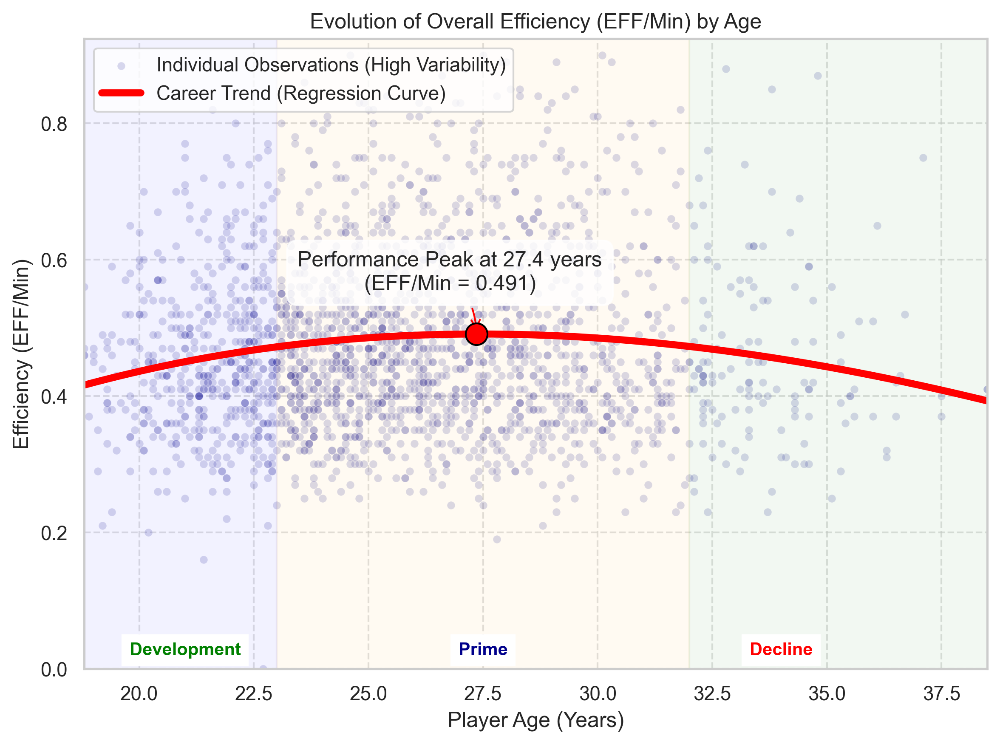
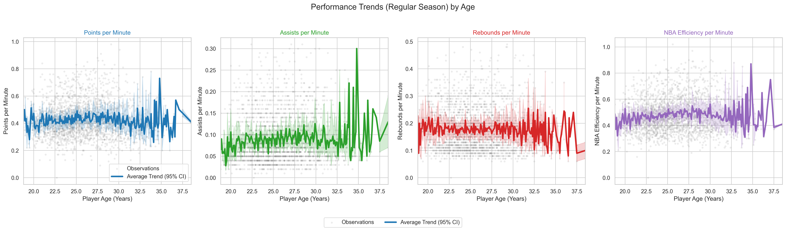
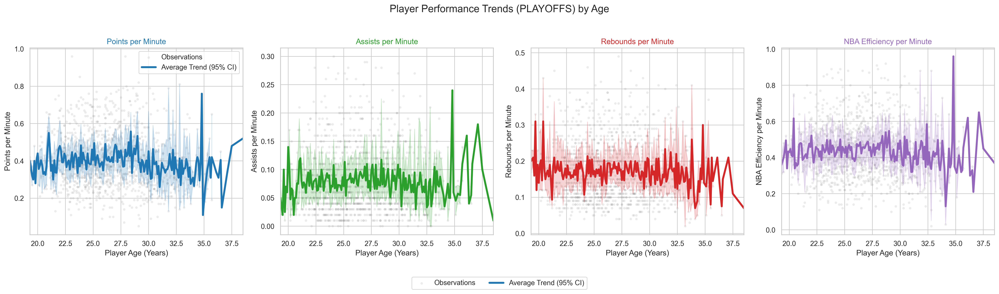

# Introduction 

The goal of this project is to analyze basketball player performance and identify the factors that most influence it. Specifically, we focus on NBA players, using detailed player statistics and physical attributes to explore performance trends and build predictive models. This project anchors itself in the high-stakes reality of modern sports management. In a multi-billion dollar industry where recruitment errors are costly, General Managers and scouts increasingly rely on data to move beyond the traditional "eye test." Our analysis aims to provide actionable insights for optimizing roster construction and contract negotiations.

Our research questions are centered around understanding which variables are most predictive of performance. For example, we seek to determine how players and performances evolve over time, how physical characteristics influence effectiveness, and which metrics can best predict scoring and overall contribution to the game.

This project builds on our original proposal by incorporating a broader dataset covering 49 leagues and over 11,000 players from 1999 to 2020. The dataset includes detailed performance statistics, contextual information (league, season, stage), biometric data (height, weight, birth year), and background information (draft, high school, nationality). Our initial focus was on exploratory data analysis (EDA) to understand the structure and key features of the data. After reviewing the dataset, we refined our approach to include both EDA and predictive modeling, allowing us to quantify relationships between variables and estimate future player performance.    

# Data 

## Data Sources

Our project uses two primary datasets found on kaggle.com:

players_stats_by_season_full_details.xlsx, which covers professional basketball seasons from 1999 to 2020 across 49 leagues, representing around 11,000 players. It contains detailed information such as birth dates, height, weight, nationality, and high school background, along with comprehensive season statistics (points, rebounds, assists, shooting percentages, minutes, games played, and more). This dataset offers much more than raw numbers: it provides a broad view of global player performance over more than two decades, making it a strong foundation for comparative and longitudinal analysis.

NBA_Anthropometric.csv, which contains anthropometric measurements from NBA Draft Combine events held between 2000 and 2023. The NBA Draft Combine is a yearly showcase where invited prospects undergo physical testing, medical exams, athletic drills, shooting evaluations, and five-on-five scrimmages in front of NBA coaches, general managers, and scouts. Since combine results can strongly influence a player's draft stock and career opportunities, these measurements are highly relevant for performance analysis. The data was originally obtained through the NBA Stats API and converted from imperial to metric units.

Both datasets were loaded into Python and inspected to understand their structure.

```{python}
#| label: setup
#| warning: false
# importations 
import pandas as pd
import unicodedata
import seaborn as sns
import matplotlib.pyplot as plt
import statsmodels.api as sm
import numpy as np
import statsmodels.formula.api as smf
import plotly.graph_objects as go
from scipy import stats
from sklearn.compose import ColumnTransformer
from sklearn.linear_model import LinearRegression
from sklearn.preprocessing import PolynomialFeatures, OneHotEncoder
from sklearn.pipeline import Pipeline
from sklearn.metrics import r2_score
from itertools import product


# Config affichage
import matplotlib.pyplot as plt
import seaborn as sns
plt.rcParams.update({'figure.max_open_warning': 0})
import pandas as pd
pd.set_option('display.max_columns', None)

# Load Datasets
# Note: Ensure these files are in the same directory as the .qmd file
file_path1 = "players_stats_by_season_full_details.xlsx"
file_path2 = "NBA_Anthropometric.csv"

try:
    df1 = pd.read_excel(file_path1)
    df2 = pd.read_csv(file_path2)
    print("Data loaded successfully.")
except FileNotFoundError:
    print("Error: Data files not found. Please ensure xlsx and csv are in the folder.")
```

## Data Cleaning and Pre-processing

The two datasets did not perfectly match (different naming formats, missing players, duplicates).
As a first step, we identified and kept only the players present in both datasets.
```{python}
#| label: merging-data

# Normalize names for merging
def normalize_name(s):
    if pd.isna(s):
        return s
    s = str(s).lower().strip()
    s = unicodedata.normalize('NFKD', s).encode('ascii', 'ignore').decode('ascii')
    s = s.replace('.', '').replace("'", '').replace('-', ' ')
    s = ' '.join(s.split())
    return s

# Create normalized name columns
df1['player_norm'] = df1['Player'].apply(normalize_name)
df2['player_norm'] = df2['player_name'].apply(normalize_name)

# Remove duplicates in anthropometric data before merge
df2_unique = df2.drop_duplicates(subset=['player_norm']).copy()

# Perform inner merge
merged = pd.merge(df1, df2_unique, on='player_norm', how='inner', suffixes=('_stats','_anthro'))

print(f"Merged rows: {len(merged)}")
```

We also ensured consistent player identification across both sources by normalizing the player name fields and comparing unique values, which prevented duplicated entries and guaranteed that each player-season appears only once in the final dataset. In addition, several columns (e.g., height_stats, birth_month, birth_year, player_name, height_cm) were removed because they were either duplicated across datasets, irrelevant for performance modeling, inconsistent, or missing for many players.
```{python}
#cleaning data, on supprime les colonnes height_stats, birth_month, birth_year and player_name, height_cm, wheight_kg
"""
We drop the following columns:
- height_stats: Redundant with height_anthro
- birth_month: Not needed for analysis
- birth_year: Not needed for analysis
- player_name: Redundant with Player   
- height_cm: Redundant with height_anthro
- wheight_kg: Redundant with weight_anthro
"""

cols_to_drop = ['height_stats', 'birth_month', 'birth_year', 'player_name', 'height_cm', 'weight_kg']

# drop from merged (safe: only drop columns that exist)
merged = merged.drop(columns=[c for c in cols_to_drop if c in merged.columns])
```
We also addressed inconsistencies in date formats within the birth_date column to enable precise age calculations. Since many players appear in the dataset across multiple seasons, relying on a static age would be inaccurate. We therefore calculated a dynamic age for each season entry by computing the time difference between the player's normalized birth date and the start of that specific season (fixed at October 1st). This step was crucial for correctly analyzing the "aging curve" and performance evolution throughout a player's career.
```{python}
#| warning: false
# convert the birth_date column to datetime format
# Convert birth_date like "Jan 26, 2002" -> "26.01.2002"
# verify the column exists
if 'birth_date' in merged.columns:

    # Parse the common textual dates
    # Exemple : "Jan 26, 2002"
    merged['birth_date_parsed'] = pd.to_datetime(
        merged['birth_date'], 
        errors='coerce', 
        infer_datetime_format=True
    )

    # Fallback for the english suffix (1st, 2nd, 3rd, 4th, ...)
    mask = merged['birth_date_parsed'].isna() & merged['birth_date'].notna()
    if mask.any():
        tmp = (
            merged.loc[mask, 'birth_date']
            .astype(str)
            .str.lower()
            .str.replace(r'(\d)(st|nd|rd|th)', r'\1', regex=True)
        )
        merged.loc[mask, 'birth_date_parsed'] = pd.to_datetime(
            tmp, 
            errors='coerce', 
            infer_datetime_format=True
        )
    
    # format the final column to "dd.mm.yyyy" (NaT → remains NaN)
    merged['birth_date'] = merged['birth_date_parsed'].dt.strftime('%d.%m.%Y')

    # delete the helper column
    merged = merged.drop(columns=['birth_date_parsed'])

else:
    print("Column 'birth_date' not found in merged.")

merged['birth_date'] = pd.to_datetime(merged['birth_date'], format='%d.%m.%Y', errors='coerce')

#calculate age at season start

def calcul_age_debut_saison(merged):
    """
    Calcuate the player's age at the start of the season (October 1 of the starting year),
    by extracting the first 4 digits from the 'Season' column.
    """
    # Extract the starting year from the 'Season' column
    merged['start_year'] = (
        merged['Season']
        .astype(str)
        .str[:4]
        .str.extract(r'(\d{4})')  # keep only 4 digit numbers
        .astype(float)
        .astype('Int64')
    )

    # Create a date for October 1 of the starting year
    merged['season_start_date'] = pd.to_datetime(
        merged['start_year'].astype(str) + '-10-01',
        errors='coerce'
    )

    # Calculate age at season start
    merged['age_debut_saison'] = ((merged['season_start_date'] - merged['birth_date']).dt.days / 365.25).round(1)

    return merged

# Application
merged = calcul_age_debut_saison(merged)
```
To make players comparable despite differences in playing time, we normalized all box-score statistics on a per-minute basis. This step was necessary because raw totals (e.g., points, rebounds, assists) are heavily influenced by the number of minutes a player spends on the court. By creating variables such as `PTS_per_min`, `REB_per_min`, `AST_per_min`, and all other equivalent per-minute metrics, we ensured that the analysis reflected true performance intensity rather than total playing time. 

To evaluate overall performance, we adopted the standard NBA Efficiency (EFF) metric but normalized it to a per-minute basis. While standard per-game EFF scores typically range from 10 to 30, our resulting `EFF_per_min` metric scales down to a range of 0 to 1.5 . The metric is calculated by summing a player's positive contributions (points, rebounds, assists, steals, blocks) and subtracting the negative ones (missed shots, missed free throws, and turnovers), all divided by minutes played. To interpret this scale: a value of 0.5 EFF/min represents a solid rotation player, while anything >1.0 EFF/min indicates elite, MVP-level productivity.
```{python}
#créattion d'une colonne keyfactors qui est unique pour chaque ligne de merged
merged['keyfactor'] = merged.index

# create per minute columns
statistiques = ['FGM','FGA','3PM','3PA','FTM','FTA','TOV','PF','ORB','DRB','REB','AST','STL','BLK','PTS']

# get minutes as float, avoid division by zero
minutes = merged['MIN'].replace(0, np.nan).astype(float)

# create minutes column, avoid division by zero
created = []
for s in statistiques:
    if s in merged.columns:
        merged[f'{s}_per_min'] = merged[s].astype(float) / minutes
        merged[f'{s}_per_min'] = merged[f'{s}_per_min'].round(2)
        created.append(f'{s}_per_min')

print("Colonnes créées :", created)

# create a column EFF_per_min (measurement of a player's effectiveness per minute played)
merged['EFF_per_min'] = (
    (merged['PTS_per_min'] + merged['REB_per_min'] + merged['AST_per_min'] + merged['STL_per_min'] + merged['BLK_per_min'])
    - ((merged['FGA_per_min'] - merged['FGM_per_min']) + (merged['FTA_per_min'] - merged['FTM_per_min']) + merged['TOV_per_min'])
).round(2)
```

The `position` column often contains dual entries (e.g., "SF/SG"). We chose to keep only the **first position** listed. In basketball reporting, the first position typically indicates the player's primary defensive assignment and offensive role, while the second indicates secondary versatility. Simplifying to the primary role allows for clearer categorical analysis.

```{python}
# keep only the players from NBA
merged_NBA = merged[merged['League'] == 'NBA']

# Filtering for Regular Season or Playoffs models
merged_NBA_regular = merged_NBA[merged_NBA['Stage'] == 'Regular_Season'].copy()
merged_NBA_playoffs = merged_NBA[merged_NBA['Stage'] == 'Playoffs'].copy()

# 1. Initial simplification (take what is before the slash)
merged_NBA_regular['Simplified_Position'] = merged_NBA_regular['position'].str.split('/').str[0].fillna('Unknown')

# 2. Name normalization (PG, SG, etc.)
valid_positions = ['PG', 'SG', 'SF', 'PF', 'C']
merged_NBA_regular['Simplified_Position'] = merged_NBA_regular['Simplified_Position'].apply(
    lambda x: x.upper() if x.upper() in valid_positions else x
)

# 3. Final cleanup of model variables
model_vars = ['EFF_per_min', 'height_anthro', 'weight_anthro', 'age_debut_saison', 'Simplified_Position']
merged_NBA_regular.dropna(subset=model_vars, inplace=True)

# 4. Remove the 'Unknown' category
merged_NBA_regular = merged_NBA_regular[merged_NBA_regular['Simplified_Position'] != 'Unknown'].copy()

# 5. Save the filtered dataset
merged_NBA_regular.to_csv('merged_NBA_regular.csv', index=False)
merged_NBA_playoffs.to_csv('merged_NBA_playoffs.csv', index=False)
```

## Main Challenges 

The main challenges were merging the two datasets and eliminating duplicate columns. We considered integrating the teams each player played for, but creating dummy variables for all teams made the system cumbersome and difficult to use. Beyond the technical complexity, integrating the teams is particularly irrelevant in our case. We don't have a complete sample of players for each team, and we don't know precisely when players play together during the season.

# Exploratory Data Analysis (EDA)

## Summary Statistics

We began our analysis by examining player physical characteristics, focusing first on height, weight, age at the start of the season, and EFF per minute. Using histograms and boxplots (considering each player only once), we explored the distribution of these stats among all players in the dataset. Summary statistics indicated the average, median, standard deviation, and interquartile range of for each player, while extreme values were flagged as potential outliers. This step allowed us to identify unusual or inconsistent entries and better understand the baseline characteristics of our population.

```{python}
#| fig-width: 8
#| fig-height: 6
#| fig-align: center

# create function to plot distribution of a numeric column per unique player
def plot_player_distribution(df, player_col, value_col, unit=None):
    """
    Trace histogram + boxplot for a numeric column (e.g., height, age, weight)
    counting each player only once.
    
    Arguments :
    - df : DataFrame
    - player_col : str, nom de la colonne joueur
    - value_col : str, nom de la colonne numérique à tracer
    - unit : str, unité à afficher (ex: 'cm', 'kg', 'years')
    """

    # Delete rows with NaN in player_col or value_col as well as duplicates
    merged = df.dropna(subset=[player_col, value_col])
    merged_unique = merged.drop_duplicates(subset=[player_col])
    values = merged_unique[value_col].dropna()

    # Calculs descriptifs
    count = values.notna().sum()
    mean = values.mean()
    median = values.median()
    std = values.std()
    q1 = values.quantile(0.25)
    q3 = values.quantile(0.75)
    iqr = q3 - q1
    seuil_bas = q1 - 1.5 * iqr
    seuil_haut = q3 + 1.5 * iqr
    outliers_sup = merged[(merged[value_col] > seuil_haut)].sort_values(by=value_col, ascending=True)
    outliers_inf = merged[(merged[value_col] < seuil_bas)].sort_values(by=value_col, ascending=False)

    # Graphiques
    sns.set(style="whitegrid")
    fig, axes = plt.subplots(2, 1, figsize=(8, 6), gridspec_kw={'height_ratios':[3, 1]})

    # Histogramme + KDE
    sns.histplot(values, kde=True, bins=30, color='steelblue', ax=axes[0])
    axes[0].axvline(mean, color='red', linestyle='--', label=f"Mean: {mean:.1f} {unit or ''}")
    axes[0].axvline(median, color='green', linestyle='-.', label=f"Median: {median:.1f} {unit or ''}")
    axes[0].set_title(f"Distribution of player {value_col} ({count} unique players)")
    axes[0].set_xlabel(f"{value_col} ({unit or ''})")
    axes[0].legend()

    # Boxplot
    sns.boxplot(x=values, color='lightgray', ax=axes[1])
    axes[1].axvline(mean, color='red', linestyle='--')
    axes[1].set_xlabel(f"{value_col} ({unit or ''})")
    axes[1].set_title(f"Boxplot — mean: {mean:.1f} {unit or ''}, std: {std:.1f}, IQR: {iqr:.1f}")

    plt.tight_layout()
    plt.show()

    # Résumé numérique
    print(f"{value_col.upper()} — Count: {count}, Mean: {mean:.1f} {unit or ''}, Median: {median:.1f} {unit or ''}, Std: {std:.1f}, IQR: {iqr:.1f}")
   # print('Outliers supérieurs:')
   # print(outliers_sup[['keyfactor','Player', value_col, 'Season']])
   # print('Outliers inférieurs:')
   # print(outliers_inf[['keyfactor','Player', value_col, 'Season']])
```
```{python}
# call of the function to plot the height
plot_player_distribution(merged, player_col='Player', value_col='height_anthro', unit='cm')
```
```{python}
# call of the function to plot the weight
plot_player_distribution(merged, player_col='Player', value_col='weight_anthro', unit='kg')
```
```{python}
# call of the function to plot the age of the players at the start of each season they have played
plot_player_distribution(merged, player_col='keyfactor', value_col='age_debut_saison', unit='years')
```
```{python}
# call of the function to plot the overall EFF per minutes
plot_player_distribution(merged, player_col='keyfactor', value_col='EFF_per_min', unit='performance')
```
Here we visualize the target variable `EFF_per_min`. As explained in the preprocessing, the values are small. The distribution is somewhat normal but with a right skew.
Which indicates that "superstar" productivity is rare. Most players cluster around the 0.4-0.6 range.


We also analyzed how player performance changes with age by looking at per-minute efficiency (EFF/Min) for players who played multiple seasons. Using a polynomial trend line, we were able to see the general evolution of performance across a career and identify the age at which players typically reach their peak. This analysis is important because it shows not just individual variation but the overall pattern of development and decline, helping us understand typical career trajectories in the NBA.
```{python}
# Determine the age column
age_col = 'Age'
if 'age_debut_saison' in merged_NBA_regular.columns:
    age_col = 'age_debut_saison'

merged_NBA_regular[age_col] = pd.to_numeric(
    merged_NBA_regular[age_col],
    errors='coerce'
)


#  1. Filtering multi-season players and data cleaning 
player_season_counts = merged_NBA_regular.groupby('Player')['Season'].nunique()
multi_season_players = player_season_counts[player_season_counts > 1].index

df_analysis = merged_NBA_regular[
    merged_NBA_regular['Player'].isin(multi_season_players)
].copy()


#  2. Identifying the performance peak (polynomial regression) 
coeffs = np.polyfit(df_analysis[age_col], df_analysis['EFF_per_min'], 3)
poly = np.poly1d(coeffs)

age_min = df_analysis[age_col].min()
age_max = df_analysis[age_col].max()
age_range = np.linspace(age_min, age_max, 100)
predicted_eff = poly(age_range)

peak_index = np.argmax(predicted_eff)
peak_age = age_range[peak_index]
peak_eff = predicted_eff[peak_index]
peak_age_rounded = round(peak_age, 1)


#  3. Combined visualization (scatter + trend + annotations) 
plt.figure(figsize=(8, 6))

# A. Scatter plot of all observations (shows high variability)
sns.scatterplot(
    data=df_analysis,
    x=age_col,
    y='EFF_per_min',
    alpha=0.15,
    color='darkblue',
    s=20,
    label='Individual Observations (High Variability)'
)

# B. Polynomial trend curve (shows career evolution)
plt.plot(
    age_range,
    predicted_eff,
    color='red',
    linestyle='-',
    linewidth=4,
    label='Career Trend (Regression Curve)'
)

# C. Performance peak annotation
plt.scatter(
    peak_age,
    peak_eff,
    color='red',
    s=150,
    zorder=5,
    edgecolor='black'
)
plt.annotate(
    f"Performance Peak at {peak_age_rounded} years\n(EFF/Min = {peak_eff:.3f})",
    (peak_age, peak_eff),
    textcoords="offset points",
    xytext=(-15, 25),
    ha='center',
    arrowprops=dict(
        arrowstyle="->",
        connectionstyle="arc3,rad=-0.2",
        color='red'
    ),
    bbox=dict(boxstyle="round,pad=0.5", fc="white", alpha=0.8)
)

# D. Determine a low Y position for labels
y_pos_low = df_analysis['EFF_per_min'].min() + 0.02

# E. Career phase annotations (bottom of the plot)
plt.axvspan(age_min, 23, color='blue', alpha=0.05)
plt.text(
    21, y_pos_low, 'Development',
    color='green', ha='center', fontsize=10,
    weight='bold', backgroundcolor='white'
)

plt.axvspan(32, age_max, color='green', alpha=0.05)
plt.text(
    34, y_pos_low, 'Decline',
    color='red', ha='center', fontsize=10,
    weight='bold', backgroundcolor='white'
)

plt.axvspan(23, 32, color='orange', alpha=0.05)
plt.text(
    27.5, y_pos_low, 'Prime',
    color='darkblue', ha='center', fontsize=10,
    weight='bold', backgroundcolor='white'
)


plt.title("Evolution of Overall Efficiency (EFF/Min) by Age")
plt.xlabel("Player Age (Years)")
plt.ylabel("Efficiency (EFF/Min)")
plt.xlim(age_min, age_max)
plt.ylim(
    df_analysis['EFF_per_min'].min() * 0.95,
    df_analysis['EFF_per_min'].quantile(0.99) * 1.1
)
plt.legend(loc='upper left')
plt.grid(True, linestyle='--', alpha=0.6)
plt.tight_layout()

# Save the figure
plt.savefig('efficiency_evolution_by_age.png', dpi=300, bbox_inches="tight")

plt.show()
```

## Key findings 

First, the distributions of height, weight, and age confirmed the expected structure of an NBA population: players are generally very tall, with most heights clustered around similar ranges, and age is centered around the mid-20s. The boxplots also helped us spot a few outliers in height and weight, which could indicate unusual player profiles or data inconsistencies.

When looking at efficiency across ages, the curve we plotted showed a clear performance peak at around 27.4 years old. This aligns with the idea that players combine both physical prime and solid experience at that age. Before that, efficiency tends to increase gradually as players develop, and after the peak, we observed a slow decline that matches the natural physical aging curve. Even though this is just a broad trend, it gives a first impression of how career progression typically looks in the NBA.




# Analysis

For the analysis, we focused on a few statistical models to better understand which factors actually drive player performance. We mainly used simple and multiple linear regressions to see how variables like height, weight, wingspan, age, and position relate to EFF per minute when looked at together. These models help us go beyond basic trends from the EDA and test whether the patterns we saw still hold once variables are combined.
```{python}
# creation of a linear regression function with statsmodels
def regression_lineaire(df, cible, variables):
    
    # Vérifie la présence des colonnes
    colonnes = [cible] + variables
    data = df[colonnes].dropna()
    
    # Définition des variables
    X = data[variables]
    y = data[cible]
    
    # Ajout de la constante
    X = sm.add_constant(X)
    
    # Modèle
    model = sm.OLS(y, X).fit()

    def stars(p):
        if p < 0.01:
            return "***"
        elif p < 0.05:
            return "**"
        elif p < 0.1:
            return "*"
        else:
            return ""

    results = pd.DataFrame({
        "Coefficient": model.params.round(3),
        "Std. Error": model.bse.round(3),
        "p-value": model.pvalues.round(3)
    })

    results[""] = model.pvalues.apply(stars)

    # Add model statistics at the bottom
    stats = pd.DataFrame(
        {
            "Coefficient": ["", f"{model.rsquared:.3f}", f"{int(model.nobs)}"],
            "Std. Error": ["", "", ""],
            "p-value": ["", "", ""],
            "": ["", "", ""]
        },
        index=["", "R-squared", "Observations"]
    )

    results = pd.concat([results, stats])
    print("Linear Regression")
    print(f"Dependent Variable : {cible}")
    print(f"Explicatives Variables : {', '.join(variables)}\n")
    return results
```

## Simple Linear Regressions

After that, we explored the relationship between player attributes and performance using simple linear regression models. Specifically, we regressed `EFF_per_min` on individual physical or demographic variables, such as height. This approach allowed us to quantify how each attribute influences overall efficiency per minute and to assess the statistical significance of the effect. For example, regressing efficiency on height helped determine whether taller players tend to be more effective on a per-minute basis. By running these regressions for several key variables, we identified which attributes are significant predictors of performance and which have little to no measurable effect.
```{python}
regression_lineaire(merged_NBA, 'EFF_per_min', ['height_anthro'])
```
```{python}
regression_lineaire(merged_NBA, 'EFF_per_min', ['wingspan'])
```
```{python}
regression_lineaire(merged_NBA, 'EFF_per_min', ['weight_anthro'])
```
```{python}
regression_lineaire(merged_NBA, 'EFF_per_min', ['age_debut_saison'])
```

## Multiple Linear Regressions

```{python}
def multiple_regression_formula(formula, data):
    """
    Run OLS using a formula and return a clean results DataFrame
    with significance stars and model statistics.
    """
    model = smf.ols(formula=formula, data=data).fit()

    def stars(p):
        if p < 0.01: return "***"
        elif p < 0.05: return "**"
        elif p < 0.1: return "*"
        else: return ""

    results = pd.DataFrame({
        "Coefficient": model.params.round(3),
        "Std. Error": model.bse.round(3),
        "p-value": model.pvalues.round(3)
    })

    results[""] = model.pvalues.apply(stars)

    # Ajouter R² et nombre d'observations
    stats = pd.DataFrame(
        {
            "Coefficient": ["", f"{model.rsquared:.3f}", f"{int(model.nobs)}"],
            "Std. Error": ["", "", ""],
            "p-value": ["", "", ""],
            "": ["", "", ""]
        },
        index=["", "R-squared", "Observations"]
    )

    results = pd.concat([results, stats])

    return results

```

After analyzing individual variables with simple regressions, we then performed multiple linear regressions to see how these factors together influence scoring efficiency. For example, we modeled EFF_per_min as a function of height, weight, age, and the interaction between height and age. We did that including the position of the player as well, which influences quite a lot how much a player scores, since different positions have different typical roles and responsibilities on the court.

```{python}
formula1 = 'EFF_per_min ~ height_anthro + weight_anthro + age_debut_saison + height_anthro:age_debut_saison'

print(" Multiple Linear Regression Results (EFF_per_min vs Player Profile) ")
print("Model: EFF_per_min = B0 + B1*Height + B2*Weight + B3*Age + B4*(Height * Age)")
multiple_regression_formula(formula1, merged_NBA_regular)
```

The first model, which excludes player position, shows that both height and weight are significant predictors, with positive coefficients suggesting that taller and heavier players tend to have higher efficiency per minute (`EFF_per_min`). However, Age and its interaction with height are found to be statistically insignificant.  This model only accounts for a small amount of the variance in efficiency, as indicated by a low $\text{R-squared}$ of $0.088$.
```{python}
formula2 = 'EFF_per_min ~ height_anthro + weight_anthro + age_debut_saison + height_anthro:age_debut_saison + C(Simplified_Position)'

print(" Multiple Linear Regression Results (EFF_per_min vs Player Profile + Position) ")
print("Model: EFF_per_min = f(Height, Weight, Age, Height * Age, Position)")
multiple_regression_formula(formula2, merged_NBA_regular)
```

The second, more powerful model (with $\text{R-squared}=0.160$) confirms that Position is a major determinant of efficiency. The significant and negative coefficients for PF, SF, and SG (relative to the unlisted reference position C) indicate that these positions typically have lower `EFF_per_min`. Critically, even in this more comprehensive model, the effects of Age and the height-age interaction remain statistically insignificant (p-values $>0.4$), meaning the written interpretation at the bottom regarding age improving efficiency is not supported by this specific data.

## Regular Season VS Playoffs

We finally compared performance in the regular season with that in the playoffs. This comparison is particularly important because playoff games carry higher stakes: players are expected to perform at their best, yet they also face greater pressure. 
```{python}
#  3. Visualization: Evolution of the 4 performance metrics by Age 
metrics_to_plot = {
    'PTS_per_min': 'Points per Minute',
    'AST_per_min': 'Assists per Minute',
    'REB_per_min': 'Rebounds per Minute',
    'EFF_per_min': 'NBA Efficiency per Minute'  # Requested metric
}

sns.set_style("whitegrid")
fig, axes = plt.subplots(1, 4, figsize=(22, 6), sharex=True)
fig.suptitle("Performance Trends (Regular Season) by Age", fontsize=16)

colors = ['#1f77b4', '#2ca02c', '#d62728', '#9467bd']  # Blue, Green, Red, Purple

for i, (metric, title) in enumerate(metrics_to_plot.items()):
    ax = axes[i]
    color = colors[i]

    df_plot = df_analysis.dropna(subset=[metric])

    # 1. Scatter plot of all observations (shows variability)
    sns.scatterplot(
        data=df_plot,
        x=age_col,
        y=metric,
        alpha=0.15,
        color='gray',
        s=15,
        ax=ax,
        label='Observations' if i == 0 else ""
    )

    # 2. Mean trend line with confidence interval
    sns.lineplot(
        data=df_plot,
        x=age_col,
        y=metric,
        estimator='mean',
        errorbar=('ci', 95),  # 95% confidence interval
        color=color,
        linewidth=3,
        label='Average Trend (95% CI)' if i == 0 else "",
        ax=ax
    )

    ax.set_title(title, fontsize=12, color=color)
    ax.set_xlabel('Player Age (Years)')
    ax.set_ylabel(title)
    ax.set_xlim(df_plot[age_col].min(), df_plot[age_col].max())


# Add a global legend
handles, labels = axes[0].get_legend_handles_labels()
fig.legend(handles, labels, loc='upper center', ncol=2, bbox_to_anchor=(0.5, 0.0))

plt.tight_layout(rect=[0, 0.03, 1, 0.95])

# Save the figure
plt.savefig('performance_evolution_by_age.png', dpi=300, bbox_inches="tight")

#  COMMAND TO DISPLAY THE PLOT INTERACTIVELY 
plt.show()
```



```{python}
#  1. Filtering multi-season players and data cleaning 
player_season_counts = merged_NBA_playoffs.groupby('Player')['Season'].nunique()
multi_season_players = player_season_counts[player_season_counts > 1].index

df_analysis_playoffs = merged_NBA_playoffs[
    merged_NBA_playoffs['Player'].isin(multi_season_players)
].copy()

#  2. Visualization: Evolution of the 4 performance metrics by Age (PLAYOFFS) 
metrics_to_plot = {
    'PTS_per_min': 'Points per Minute',
    'AST_per_min': 'Assists per Minute',
    'REB_per_min': 'Rebounds per Minute',
    'EFF_per_min': 'NBA Efficiency per Minute'
}

sns.set_style("whitegrid")
fig, axes = plt.subplots(1, 4, figsize=(22, 6), sharex=True)
fig.suptitle("Player Performance Trends (PLAYOFFS) by Age", fontsize=16)

colors = ['#1f77b4', '#2ca02c', '#d62728', '#9467bd']

for i, (metric, title) in enumerate(metrics_to_plot.items()):
    ax = axes[i]
    color = colors[i]

    df_plot = df_analysis_playoffs.dropna(subset=[metric])

    # 1. Scatter plot of all observations (shows variability)
    sns.scatterplot(
        data=df_plot,
        x=age_col,
        y=metric,
        alpha=0.15,
        color='gray',
        s=15,
        ax=ax,
        label='Observations' if i == 0 else ""
    )

    # 2. Mean trend line with confidence interval
    # Note: Using a trend line approach to capture career trajectories
    sns.lineplot(
        data=df_plot,
        x=age_col,
        y=metric,
        estimator='mean',
        errorbar=('ci', 95),  # 95% confidence interval
        color=color,
        linewidth=3,
        label='Average Trend (95% CI)' if i == 0 else "",
        ax=ax
    )

    ax.set_title(title, fontsize=12, color=color)
    ax.set_xlabel('Player Age (Years)')
    ax.set_ylabel(title)
    ax.set_xlim(df_plot[age_col].min(), df_plot[age_col].max())


# Add a global legend
handles, labels = axes[0].get_legend_handles_labels()
fig.legend(handles, labels, loc='upper center', ncol=2, bbox_to_anchor=(0.5, 0.0))

plt.tight_layout(rect=[0, 0.03, 1, 0.95])

# Save the figure
plt.savefig('performance_evolution_by_age_playoffs.png', dpi=300, bbox_inches="tight")

#  COMMAND TO DISPLAY THE PLOT INTERACTIVELY 
plt.show()
```


```{python}
# 1. Filter multi-season players and clean data
player_season_counts = merged_NBA.groupby('Player')['Season'].nunique()
multi_season_players = player_season_counts[player_season_counts > 1].index

df_analysis = merged_NBA[
    merged_NBA['Player'].isin(multi_season_players)
].copy()

# Minimum playing time filter
df_analysis = df_analysis[df_analysis['MIN'] >= 100].copy()

# Create additional variables for testing
df_analysis['FGA_minus_FGM_per_min'] = (
    df_analysis['FGA_per_min'] - df_analysis['FGM_per_min']
)
df_analysis['FTA_minus_FTM_per_min'] = (
    df_analysis['FTA_per_min'] - df_analysis['FTM_per_min']
)

# 2. Student t-tests for ALL metrics (Regular Season vs Playoffs)
metrics_to_test = {
    'PTS_per_min': 'Points per Min (Offense)',
    'AST_per_min': 'Assists per Min (Offense)',
    'REB_per_min': 'Rebounds per Min (Offense)',
    'EFF_per_min': 'Efficiency per Min (Overall)',
    'STL_per_min': 'Steals per Min (Defense)',
    'BLK_per_min': 'Blocks per Min (Defense)',
    'TOV_per_min': 'Turnovers per Min (Negative)',
    'FGA_minus_FGM_per_min': 'Missed FGs per Min (Negative)',
    'FTA_minus_FTM_per_min': 'Missed FTs per Min (Negative)'
}

def stars(p):
    if p < 0.01:
        return "***"
    elif p < 0.05:
        return "**"
    elif p < 0.1:
        return "*"
    else:
        return ""

results = []

for metric, label in metrics_to_test.items():
    reg = df_analysis[df_analysis['Stage'] == 'Regular_Season'][metric].dropna()
    po = df_analysis[df_analysis['Stage'] == 'Playoffs'][metric].dropna()

    if len(reg) > 1 and len(po) > 1:
        t_stat, p_value = stats.ttest_ind(reg, po, equal_var=False)

        results.append({
            "Metric": label,
            "Regular Season Mean": reg.mean(),
            "Playoffs Mean": po.mean(),
            "Mean Diff (PO - RS)": po.mean() - reg.mean(),
            "p-value": p_value,
            "": stars(p_value)
        })

results_df = pd.DataFrame(results).round(4)
results_df = results_df.sort_values("p-value")

results_df
```

**Regular Season vs. Playoffs Performance**

Overall, players exhibit reduced offensive efficiency in the playoffs. 
Declines in points, assists, and overall efficiency suggest that the heightened defensive intensity 
and pressure of postseason competition limit scoring opportunities and offensive flow. 
Defensive metrics, such as steals and rebounds, also decrease slightly, reflecting the more 
physical and strategic nature of playoff games. Metrics related to rare events, like missed shots 
or blocks, remain largely unchanged, indicating that shooting accuracy and occasional defensive 
actions are less affected by the stage.

```{python}
# 1. Filtering for robust analysis (minimum playing time) 
df_robust = merged_NBA[merged_NBA['MIN'] >= 100].copy()


#  2. Compute average EFF/min per player over Regular Season 
player_reg_season_mean = (
    df_robust[df_robust['Stage'] == 'Regular_Season']
    .groupby('Player')['EFF_per_min']
    .mean()
    .reset_index()
    .rename(columns={'EFF_per_min': 'Avg_EFF_Reg_Season'})
)

# Identify elite players (Top 10% in Regular Season EFF/min)
top_percentile = player_reg_season_mean['Avg_EFF_Reg_Season'].quantile(0.90)
elite_players = player_reg_season_mean[
    player_reg_season_mean['Avg_EFF_Reg_Season'] >= top_percentile
]['Player']


#  3. Compute Playoffs – Regular Season differential for elite players 
pivot_eff = (
    df_robust
    .groupby(['Player', 'Stage'])['EFF_per_min']
    .mean()
    .unstack()
    .reset_index()
    .rename(columns={
        'Regular_Season': 'Avg_EFF_Reg_Season_Full',
        'Playoffs': 'Avg_EFF_Playoffs_Full'
    })
)

# Keep players who played in both stages
pivot_eff = pivot_eff.dropna(
    subset=['Avg_EFF_Reg_Season_Full', 'Avg_EFF_Playoffs_Full']
)

elite_comparison = pivot_eff[
    pivot_eff['Player'].isin(elite_players)
].copy()

elite_comparison['EFF_Differential'] = (
    elite_comparison['Avg_EFF_Playoffs_Full']
    - elite_comparison['Avg_EFF_Reg_Season_Full']
)

#  4. Summary statistics 
summary_df = pd.DataFrame({
    "Metric": [
        "Elite threshold (90th percentile, Reg. Season)",
        "Number of elite players",
        "Avg EFF/min (Reg. Season, Elite)",
        "Avg EFF/min (Playoffs, Elite)",
        "Avg differential (Playoffs − Reg. Season)"
    ],
    "Value": [
        round(top_percentile, 4),
        len(elite_players),
        round(elite_comparison['Avg_EFF_Reg_Season_Full'].mean(), 4),
        round(elite_comparison['Avg_EFF_Playoffs_Full'].mean(), 4),
        round(elite_comparison['EFF_Differential'].mean(), 4)
    ]
})

summary_df
```

**Elite players and playoff performance**

Elite players defined as the top 10% in regular-season efficiency per minute
tend to be able to maintain, their efficiency during the playoffs.
This suggests that top performers are better able to sustain high-level production
under increased competitive pressure.
```{python}
elite_comparison \
    .sort_values(by='EFF_Differential', ascending=False) \
    .head(5) \
    [['Player',
      'Avg_EFF_Reg_Season_Full',
      'Avg_EFF_Playoffs_Full',
      'EFF_Differential']] \
    .round(4)
```


## What we discovered

From our analysis, a few things stood out. We saw that height and experience don’t play the same role for everyone. For rather short players, having more experience becomes a key factor in their performance. This suggests that being tall gives an immediate advantage, whereas shorter players depend more on skill development and game understanding. 

When looking at performance over age, we identified a clear peak around 27.4 years old, which makes sense: players are still in their physical prime but already have enough experience to make better decisions.

We also noticed that player position explains a big part of the differences in EFF per minute. Interior players, so mainly Centers (C) and Power Forwards (PF), tend to show higher efficiency than perimeter players such as Small Forwards (SF), Shooting Guards (SG), and Point Guards (PG). This makes sense because players in inside positions are closer to the basket, take higher-percentage shots, and are more involved in rebounds and actions near the rim, which naturally boosts their efficiency.

Another interesting pattern is that players who are still active at older ages usually have a very high EFF, which means that players have to be really good to stay in the league after a certain age. 

Lastly, we compared Regular Season and Playoffs performances. We expected players to perform better in Playoffs because the games matter more, but what we observed is the opposite: almost everyone sees their EFF drop. The simplest explanation, besides higher pressure, is the increase in defensive intensity, as scoring becomes harder, mistakes are punished more, and efficiency tends to fall. Only two players in our dataset actually improved their EFF in the Playoffs; for all the others, it went down.

# 5. Conclusion 

## What we achieved 

So far, we’ve been able to get a much clearer picture of what really affects NBA player performance. With the EDA and analysis, we spotted several interesting patterns, like how experience matters more for shorter players, how positions influence efficiency, when players usually hit their peak, and how performance changes from the regular season to the playoffs.

We also started testing these ideas with some basic statistical models, mainly linear and polynomial regressions, to see if the trends hold when variables are analyzed together. This helped confirm most of what we saw in the data.

Overall, we now have a good foundation and a better understanding of the main elements that shape a player’s performance, which sets us up well for the rest of the project.

## Can we push further ?

```{python}
def compare_linear_polynomial(df, feature_col, target_col="EFF_per_min", degree=2, figsize=(8,5)):
    """
    Compare linear vs polynomial regression for a given feature against the target.
    
    Parameters
    ----------
    df : pd.DataFrame
        Data containing feature and target columns.
    feature_col : str
        Name of the explanatory variable.
    target_col : str, default="EFF_per_min"
        Name of the target variable.
    degree : int, default=2
        Degree of the polynomial regression.
    figsize : tuple, default=(8,5)
        Figure size for plotting.
    
    Returns
    -------
    r2_lin : float
        R² of linear regression.
    r2_poly : float
        R² of polynomial regression.
    """
    # Prepare data
    data = df[[feature_col, target_col, 'Player']].dropna().drop_duplicates(subset=['Player'], keep='first')
    X = data[[feature_col]].values
    y = data[target_col].values

    # Linear regression
    lin_reg = LinearRegression()
    lin_reg.fit(X, y)
    y_pred_lin = lin_reg.predict(X)
    r2_lin = r2_score(y, y_pred_lin)

    # Polynomial regression
    poly = PolynomialFeatures(degree=degree, include_bias=False)
    X_poly = poly.fit_transform(X)
    poly_reg = LinearRegression()
    poly_reg.fit(X_poly, y)
    y_pred_poly = poly_reg.predict(X_poly)
    r2_poly = r2_score(y, y_pred_poly)

    # Sort for plotting
    sorted_idx = np.argsort(X[:, 0])
    X_sorted = X[sorted_idx]
    y_sorted_lin = y_pred_lin[sorted_idx]
    X_sorted_poly = poly.transform(X_sorted)
    y_sorted_poly = poly_reg.predict(X_sorted_poly)

    # Plot
    plt.figure(figsize=figsize)
    plt.scatter(X, y, alpha=0.4, label="Players")
    plt.plot(X_sorted, y_sorted_lin, color="green", label=f"Linear (R²={r2_lin:.3f})")
    plt.plot(X_sorted, y_sorted_poly, color="red", label=f"Polynomial deg={degree} (R²={r2_poly:.3f})")
    plt.xlabel(feature_col)
    plt.ylabel(target_col)
    plt.title(f"{feature_col} → {target_col} (Linear vs Polynomial)")
    plt.legend()
    plt.grid(alpha=0.3)
    plt.tight_layout()
    plt.show()

    return r2_lin, r2_poly

```


```{python}
# Compare wingspan vs EFF_per_min
r2_lin, r2_poly = compare_linear_polynomial(merged_NBA, "wingspan", degree=2)
```

```{python}
# Compare weight_anthro vs EFF_per_min
r2_lin, r2_poly = compare_linear_polynomial(merged_NBA, "weight_anthro", degree=2)
```
```{python}
# Compare height_anthro vs EFF_per_min
r2_lin, r2_poly = compare_linear_polynomial(merged_NBA, "height_anthro", degree=2)
```

```{python}
# Multiple Polynomial Regression: Predicting EFF_per_min
# Prepare data
df = merged_NBA.dropna(subset=["EFF_per_min", "height_anthro", "wingspan", "position"]).copy()
df.loc[:, "position_simple"] = df["position"].str.split("/").str[0]

X = df[["height_anthro", "wingspan", "position_simple"]]
y = df["EFF_per_min"].values

print(f"Number of observations: {len(df)}")

# Preprocessor: Polynomial for continuous, OneHot for categorical
preprocessor = ColumnTransformer([
    ("poly_features", PolynomialFeatures(degree=2, include_bias=False), ["height_anthro", "wingspan"]),
    ("position_simple", OneHotEncoder(drop='first', sparse_output=False), ["position_simple"])
])

# Pipeline
model = Pipeline([
    ("preprocessor", preprocessor),
    ("regression", LinearRegression())
])

# Fit model
model.fit(X, y)
y_pred = model.predict(X)
r2 = r2_score(y, y_pred)
print(f"R² of the model: {r2:.4f}")

# Extract coefficients
coef = model.named_steps["regression"].coef_
intercept = model.named_steps["regression"].intercept_
feature_names = model.named_steps["preprocessor"].get_feature_names_out()

# Display equation
print("\n=== Estimated Regression Equation ===")
print(f"EFF_per_min = {intercept:.4f}")
for name, c in zip(feature_names, coef):
    print(f" + {c:.4f} * {name}")

# Statsmodels OLS for detailed table
X_transformed = model.named_steps["preprocessor"].transform(X)
X_sm = sm.add_constant(X_transformed)
ols_model = sm.OLS(y, X_sm).fit()

# Extract table of coefficients
df_results = ols_model.summary2().tables[1].copy()
df_results.columns = ['Coefficient', 'Std.Err.', 't-stat', 'P-value', 'Conf.Int.[0.025', '0.975]']

# Color p-values for Quarto
def style_pvalue(val):
    if val < 0.05:
        return 'background-color: #d4edda; color: #155724; font-weight: bold'
    else:
        return 'color: #721c24'

jolie_table = (df_results.style
    .map(style_pvalue, subset=['P-value'])
    .format("{:.4f}")
    .background_gradient(cmap='Blues', subset=['Coefficient'])
    .set_caption("Detailed OLS Regression Results")
)

display(jolie_table)

```
We then tried with a multiple polynomial regression model to predict EFF_per_min based on player anthropometric features (height, wingspan) and position. Continuous variables are modeled with second-degree polynomial terms, while positions are one-hot encoded. The model outputs coefficients, R², and a stylized table highlighting significant predictors for easy interpretation in Quarto.

```{python}

# Define realistic ranges using percentiles
height_min, height_max = df["height_anthro"].quantile([0.05, 0.95])
wingspan_min, wingspan_max = df["wingspan"].quantile([0.05, 0.95])
positions = df["position_simple"].unique()

height_range = np.linspace(height_min, height_max, 30)
wingspan_range = np.linspace(wingspan_min, wingspan_max, 30)

# Grid search with constraints: wingspan >= height
best_eff = -np.inf
best_player = {}

for h, w, pos in product(height_range, wingspan_range, positions):
    if w < h:  # skip unrealistic wingspan
        continue
    X_test = pd.DataFrame({
        "height_anthro": [h],
        "wingspan": [w],
        "position_simple": [pos]
    })
    y_pred = model.predict(X_test)[0]
    if y_pred > best_eff:
        best_eff = y_pred
        best_player = {"height": h, "wingspan": w, "position": pos, "predicted_EFF_per_min": best_eff}

# Display the “optimal player”
print("Realistic Theoretical Optimal Player to Maximize EFF_per_min")
for k, v in best_player.items():
    if isinstance(v, float):
        print(f"{k}: {v:.2f}")
    else:
        print(f"{k}: {v}")


```
This cell uses the previously fitted regression model to identify a theoretical “optimal player” who would maximize EFF_per_min. It searches across realistic ranges of height and wingspan and considers each position. The result highlights the combination of attributes predicted to achieve the highest efficiency per minute according to the model.

```{python}
# Define realistic ranges (same as in the optimal player search)
height_min, height_max = df["height_anthro"].quantile([0.05, 0.95])
wingspan_min, wingspan_max = df["wingspan"].quantile([0.05, 0.95])
positions = df["position_simple"].unique()

height_range = np.linspace(height_min, height_max, 30)
wingspan_range = np.linspace(wingspan_min, wingspan_max, 30)

# Compute EFF_per_min surface for a fixed position (e.g., PG)
position_fixed = best_player["position"]  # use previously found optimal position
EFF_values = np.zeros((len(height_range), len(wingspan_range)))

for i, h in enumerate(height_range):
    for j, w in enumerate(wingspan_range):
        if w < h:  # skip unrealistic
            EFF_values[i, j] = np.nan
        else:
            X_test = pd.DataFrame({
                "height_anthro": [h],
                "wingspan": [w],
                "position_simple": [position_fixed]
            })
            EFF_values[i, j] = model.predict(X_test)[0]

# Create interactive 3D surface plot
fig = go.Figure(data=[go.Surface(
    z=EFF_values,
    x=height_range,
    y=wingspan_range,
    colorscale='Viridis',
    colorbar=dict(title='Predicted EFF_per_min'),
    cmin=np.nanmin(EFF_values),
    cmax=np.nanmax(EFF_values)
)])

# Add optimal player marker
fig.add_trace(go.Scatter3d(
    x=[best_player["height"]],
    y=[best_player["wingspan"]],
    z=[best_player["predicted_EFF_per_min"]],
    mode='markers+text',
    marker=dict(size=5, color='red'),
    text=["Optimal Player"],
    textposition="top center"
))

fig.update_layout(
    title=f"EFF_per_min Surface (Position={position_fixed})",
    scene=dict(
        xaxis_title='Height (cm)',
        yaxis_title='Wingspan (cm)',
        zaxis_title='Predicted EFF_per_min'
    ),
    autosize=True,
    width=800,
    height=600
)

fig.show()
```
This 3D interactive plot shows how EFF_per_min changes with height and wingspan for a fixed position (the optimal one). The red point marks the theoretical “optimal player” found in the previous step. The surface illustrates realistic ranges and highlights where efficiency peaks within plausible anthropometric combinations.